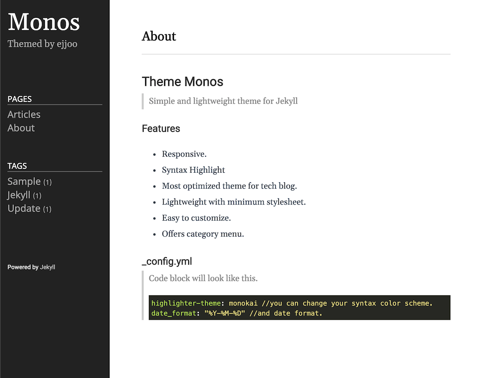

#  フリガナテスト 
[//]: #<ruby>漢字＜rt＞フリガナ</rt></ruby>
<ruby>訪<rt>おとず</rt></ruby>れるべき<ruby>時<rt>とき</rt></ruby>が<ruby>来<rt>き</rt></ruby>た  

## image TEST



# Highlighter
### Clang

int main() {
  return 0;
}


### make
``` make
CFLAGS=-DOS_LINUX
```

### C++

int main() {
  return 0;
}


Check out the [Jekyll docs][jekyll-docs] for more info on how to get the most out of Jekyll. File all bugs/feature requests at [Jekyll’s GitHub repo][jekyll-gh]. If you have questions, you can ask them on [Jekyll Talk][jekyll-talk].

[jekyll-docs]: https://jekyllrb.com/docs/home
[jekyll-gh]:   https://github.com/jekyll/jekyll
[jekyll-talk]: https://talk.jekyllrb.com/
